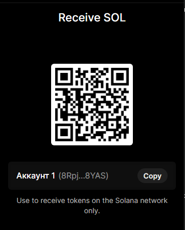

# Curve StableSwap NG Math Audit

*If this research helped you, please consider giving it a ⭐ Star.*

## 🚀 Stay Updated
Found this research useful?
* **Star ⭐** this repo to keep track of it.
* **Follow me** on GitHub for more DeFi security research.
* **Fork** it if you want to run your own experiments.

### ☕ Support the Research
If you appreciate the work and want to support further security research:


**Wallet Address (ETH/EVM):**0xBDDD7973D0DE27B715A4A5cbdb87d0DF78757b3A 


**Solana:**8RpjaJQmCrRvKHMXA5ak4CrrLNJnJionwxMfTRG8YAS

This repository contains the results of an independent mathematical audit of the `CurveStableSwapNGMath.vy` contract. During the analysis, a critical mathematical vulnerability related to precision loss (rounding errors) in the `get_D` invariant was discovered and resolved.

## Key Results
- **Discovery**: A discrepancy was identified between the Vyper implementation and the reference mathematical model.
- **Tooling**: A differential fuzzer based on the Ape Framework was developed to automatically verify the correctness of calculations.
- **Solution**: The invariant formula was optimized using a numerator-denominator separation method to prevent premature integer rounding.

## Contents
- `/contracts`: Source code for the Curve contract.
- `/scripts/fuzz_check.py`: Script for fuzzing and mathematical validation.
- `vulnerability_report.md`: Full report on the discovered vulnerability and remediation methods.

## Technology Stack
- [Ape Framework](https://apeworx.io/)
- Vyper (v0.3.10)
- Python 3.10

## How to run
1. Install Ape dependencies.
2. Compile the contract:
   ```bash
   ape compile
   ```
3. Run the fuzzer to check mathematical accuracy:
   ```bash
   ape run fuzz_check --network :local
   ```
---
The study was conducted as part of an in-depth security analysis of DeFi protocols.
